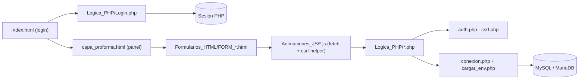

<div align="center">
  
  <h1>VeterinariaDigital</h1>
  <p><b>Gestión de una clínica veterinaria pequeña: citas, mascotas, clientes, historial clínico, ventas y compras.</b></p>
  
  
  
  
  <a href="https://github.com/Luiss2080/VeterinariaDigital/actions/workflows/ci.yml"></a>
  <p>
    <a href="#-inicio-rápido">Inicio rápido</a> ·
    <a href="#-características">Características</a> ·
    <a href="#-arquitectura">Arquitectura</a> ·
    <a href="#-pruebas">Pruebas</a> ·
    <a href="#-lo-que-todavía-no-existe">Limitaciones</a>
  </p>
</div>

Aplicación web en PHP + MySQL con frontend en HTML/CSS/JS plano (sin framework) para llevar los registros de una clínica veterinaria: citas, mascotas, clientes, historial clínico, ventas, compras, productos, proveedores y personal. **No** es un producto listo para desplegar: el repositorio no incluye el esquema de la base de datos, así que hay que reconstruir las tablas a mano (ver [limitaciones](#-lo-que-todavía-no-existe)).

## 🎬 Vista rápida

No hay capturas: la app necesita un esquema MySQL que el repositorio no contiene. Flujo principal de uso:

```text
index.html (login) ──▶ Logica_PHP/Login.php ──▶ sesión PHP
        │
        ▼
capa_proforma.html (panel con menú lateral)
        │
        ├─▶ Formularios_HTML/FORM_Citas.html      ─▶ Logica_PHP/Citas.php
        ├─▶ Formularios_HTML/FORM_Mascotas.html   ─▶ Logica_PHP/Mascotas.php
        ├─▶ Formularios_HTML/FORM_Clientes.html   ─▶ Logica_PHP/Clientes.php
        ├─▶ Formularios_HTML/FORM_Ventas.html     ─▶ Logica_PHP/Ventas.php
        └─▶ ... (13 formularios en total)
```

## ✨ Características

| Característica | Detalle |
|---|---|
| Citas | Motivo, diagnóstico, tratamiento, cobro y vínculo a mascota, cliente, trabajador, servicio e historial; validación en `ValidacionCitas.php` |
| Mascotas y clientes | Alta de ambos; los clientes admiten varios teléfonos (7 a 10 dígitos) y correos |
| Historial clínico | Diagnóstico, tratamiento, especialidades y pronóstico por mascota |
| Ventas y compras | Registro de ventas y de compras a proveedores |
| Catálogo y personal | Productos, servicios, proveedores, trabajadores, usuarios, roles y permisos |
| Autenticación | Login contra la base con `password_verify` y `session_regenerate_id`; los endpoints de datos llaman a `requireAuth()` |
| CSRF | Token de sesión verificado con `requireCsrf()` en los endpoints que modifican datos |
| Acceso a datos | `mysqli` con `prepare`/`bind_param`; las entradas además pasan por `real_escape_string` |
| Interfaz | 13 formularios con su CSS y animaciones JS propias; Bootstrap 5 en los formularios y en el panel |

## 🏗️ Arquitectura



## 🚀 Inicio rápido

| Requisito | Detalle |
|---|---|
| PHP | 8.x con extensión `mysqli` (el CI usa 8.2) |
| Base de datos | MySQL o MariaDB |

1. Clonar y configurar credenciales:
   ```bash
   git clone https://github.com/Luiss2080/VeterinariaDigital.git
   cd VeterinariaDigital
   cp .env.example .env   # editar DB_HOST, DB_PUERTO, DB_USUARIO, DB_PASSWORD, DB_NOMBRE
   ```
2. Crear la base vacía (el nombre por defecto es `sistema-zoofipetss`):
   ```bash
   mysql -u root -p -e "CREATE DATABASE \`sistema-zoofipetss\` CHARACTER SET utf8mb4"
   ```
3. **Crear las tablas a mano**: el repositorio no trae `.sql`. Hay que deducirlas de las consultas en `Logica_PHP/*.php`.
4. Sembrar el primer administrador (solo CLI; contraseña de al menos 8 caracteres):
   ```bash
   php scripts/crear_admin.php "admin" "admin@clinica.com" "unaContraseñaSegura123"
   ```
5. Servir y abrir `http://localhost:8000/index.html`:
   ```bash
   php -S localhost:8000
   ```

Los pasos 1, 2, 4 y 5 no se ejecutaron contra una base real en esta revisión, porque falta el esquema (paso 3).

<details>
<summary>Estructura de carpetas</summary>

```text
Logica_PHP/        endpoints PHP (uno por entidad) + auth.php, csrf.php, CsrfToken.php, Sesion.php
Formularios_HTML/  13 pantallas FORM_*.html
Interfaz_CSS/      estilos por pantalla
Animaciones_JS/    lógica de cada pantalla + csrf-helper.js
Assets/            imágenes
scripts/           crear_admin.php
tests/             run.php (harness propio)
conexion.php       conexión mysqli (lee .env)
cargar_env.php     cargador mínimo de .env
```

</details>

<details>
<summary>Variables de entorno (.env)</summary>

| Variable | Valor por defecto |
|---|---|
| `DB_HOST` | `localhost` |
| `DB_PUERTO` | `3306` |
| `DB_USUARIO` | `root` |
| `DB_PASSWORD` | vacío |
| `DB_NOMBRE` | `sistema-zoofipetss` |

Si no hay `.env` ni variables de entorno, `conexion.php` usa esos valores de desarrollo.

</details>

## 🧪 Pruebas

```bash
php tests/run.php
```

11 comprobaciones con un harness propio sin dependencias (no hay Composer), todas pasan. Cubren `validarDatosCita()` y el control de acceso por sesión (`usuarioAutenticado()` / `requireAuth()`). No hay pruebas de los endpoints ni contra base de datos. El CI (`.github/workflows/ci.yml`) hace `php -l` de todos los `.php` y corre este script.

## 🔒 Seguridad

- Sesiones de servidor; el login regenera el id de sesión.
- Contraseñas guardadas con `password_hash` (bcrypt).
- CSRF en endpoints que modifican datos.
- Consultas preparadas con `bind_param`.
- Credenciales de BD en `.env`, excluido del repositorio (ver `.gitignore`).
- `crear_admin.php` rechaza ejecución fuera de la línea de comandos.
- Aviso: las pantallas HTML aún consultan una bandera en `localStorage` para decidir qué mostrar; eso es solo comodidad visual. El control real está en el servidor.

## 🚧 Lo que todavía no existe

- **Esquema SQL**: no hay archivo con las tablas; se infieren del código. Es la mejora más urgente.
- Trabajadores: solo alta y listado, sin edición ni eliminación.
- No hay recuperación de contraseña: el enlace del login es un marcador.
- No hay registro público de usuarios; el primero se crea con el script.
- Sin pruebas de integración ni de los endpoints.
- Sin capturas de pantalla.

## 📄 Licencia

Sin licencia definida: todos los derechos reservados por defecto.

<div align="center"><sub>Hecho por Luiss2080 · PHP, MySQL y JavaScript sin framework</sub></div>
